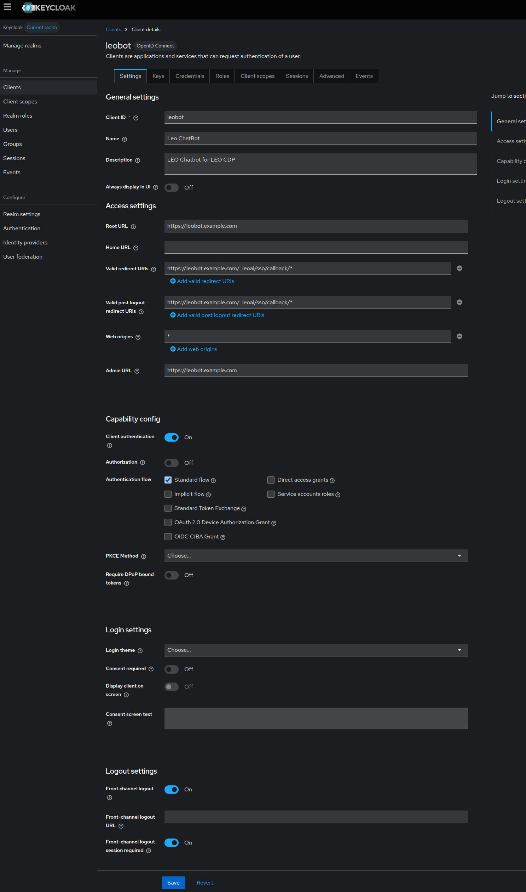

# 🧭 Keycloak Client Configuration (`leobot`)

Screenshot




Below is the verified Keycloak configuration used for **LEO BOT Admin SSO**.

### 1️⃣ General Settings

| Setting                                   | Value                                                |
| ----------------------------------------- | ---------------------------------------------------- |
| **Client ID**                             | `leobot`                                             |
| **Name**                                  | `Leo ChatBot`                                        |
| **Description**                           | `LEO Chatbot for LEO CDP`                            |
| **Root URL**                              | `https://leobot.example.com`                         |
| **Home URL**                              | *(optional)*                                         |
| **Admin URL**                             | `https://leobot.example.com`                         |
| **Access Type**                           | `Confidential` (Client Authentication = **On**)      |
| **Authorization**                         | Off                                                  |
| **Standard Flow Enabled**                 | ✅                                                    |
| **Direct Access Grants**                  | ❌                                                    |
| **Implicit Flow**                         | ❌                                                    |
| **Service Accounts Roles**                | ❌                                                    |
| **Front Channel Logout**                  | ✅ On                                                 |
| **Front-Channel Logout Session Required** | ✅ On                                                 |
| **Valid Redirect URIs**                   | `https://leobot.example.com/_leoai/sso/callback/*`   |
| **Valid Post Logout Redirect URIs**       | `https://leobot.example.com/_leoai/sso/callback/*`   |
| **Web Origins**                           | `*` *(for development only; restrict in production)* |

💡 **Note:**
Ensure `Client authentication` is toggled **On** — this makes it a *confidential client*, matching the FastAPI configuration that requires `KEYCLOAK_CLIENT_SECRET`.

---

### 2️⃣ Client Scopes

| Scope                           | Type     | Description                             |
| ------------------------------- | -------- | --------------------------------------- |
| `email`                         | Default  | Built-in scope for user email           |
| `profile`                       | Default  | Adds name, username, locale             |
| `roles`                         | Default  | Includes assigned user roles            |
| `basic`                         | Default  | Basic OpenID claims                     |
| `address`                       | Default  | Optional address info                   |
| `offline_access`                | Default | Allows refresh tokens                   |
| `microprofile-jwt`              | Optional | Adds standard JWT claims                |
| `organization`                  | Default | Organization info                       |
| *(optional)* `leobot-dedicated` | Custom   | Dedicated mappers for LEO BOT if needed |

These scopes ensure `userinfo` and JWT responses include all necessary attributes:

```json
{
  "preferred_username": "john",
  "email": "john@example.com",
  "name": "John Doe",
  "realm_access": { "roles": ["admin", "user"] }
}
```

---

### 3️⃣ Credentials Tab

After saving, navigate to **Credentials → Client Secret** and copy the value to your `.env`:

```bash
KEYCLOAK_CLIENT_SECRET=<paste here>
```

---

### 4️⃣ Realm Roles (optional)

If your admin dashboard uses role-based access, assign users the appropriate realm roles such as:

```
leobot_admin
leobot_user
```

These will appear under `realm_access.roles` in the decoded JWT and can be verified by FastAPI before granting access.

---

### 5️⃣ Callback & Logout Validation

Ensure the following endpoints work in browser tests:

| URL                                              | Purpose                 |
| ------------------------------------------------ | ----------------------- |
| `https://leobot.example.com/_leoai/sso/login`    | Start Keycloak login    |
| `https://leobot.example.com/_leoai/sso/callback` | Auth callback           |
| `https://leobot.example.com/_leoai/sso/logout`   | Keycloak + Redis logout |

---

### 6️⃣ Troubleshooting Setup

| Issue                                    | Fix                                               |
| ---------------------------------------- | ------------------------------------------------- |
| Keycloak login redirects to wrong domain | Update **Root URL** + **Redirect URIs**           |
| Invalid client secret                    | Re-generate under **Credentials**                 |
| `invalid_grant` error                    | User re-login or expired code                     |
| Session doesn’t persist                  | Check Redis connectivity and TTL (default: 3600s) |

---

✅ **Final Checklist before Deployment**

* [x] Keycloak client type: *Confidential*
* [x] Callback URL matches `/_leoai/sso/callback/*`
* [x] Redis up and reachable
* [x] `.env` contains correct secret
* [x] SSL verification disabled only in DEV

